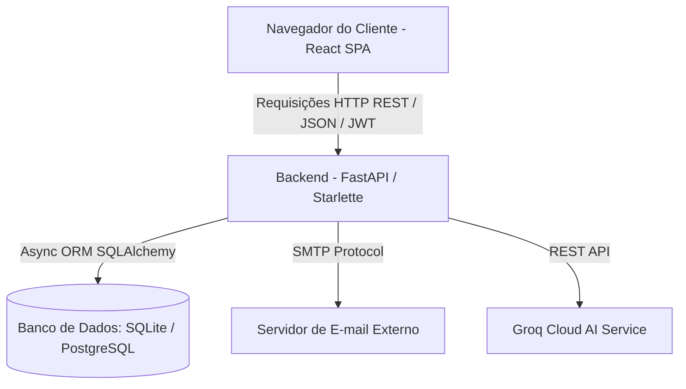
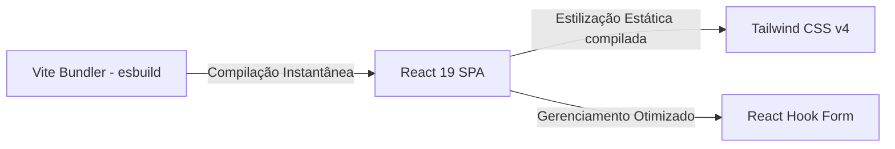
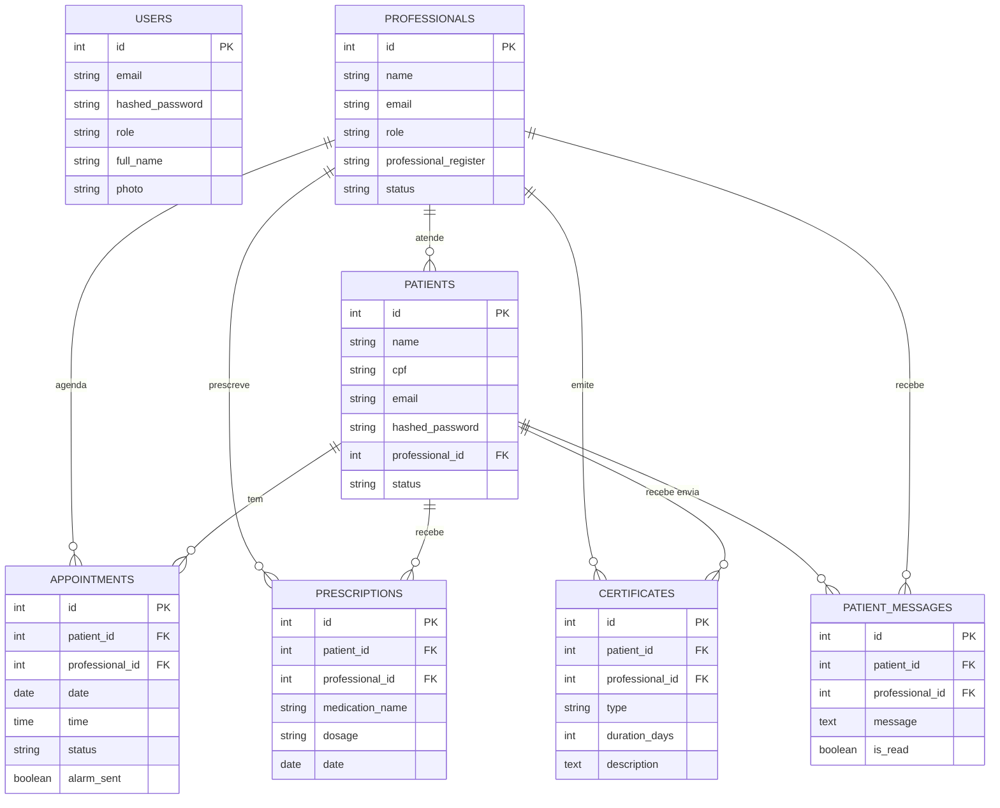

# Relatório Técnico e Especificações do Sistema — Clinical6P

Este documento apresenta uma análise técnica aprofundada da arquitetura, decisões tecnológicas, modelagem de dados, segurança e estratégias de testes do **Clinical6P**, um sistema integrado de gestão clínica e portal do paciente. Ele foi estruturado para fornecer justificativas de engenharia de software sólidas para bancas acadêmicas e avaliações comerciais.

---

## 1. Visão Geral do Produto

O **Clinical6P** é uma plataforma moderna desenvolvida para simplificar a gestão operacional de clínicas de saúde (psicologia, medicina, etc.) e estreitar o relacionamento entre profissionais de saúde e pacientes. A aplicação divide-se em duas frentes integradas:
1. **Painel Administrativo/Profissional**: Permite a secretárias, administradores e profissionais de saúde gerenciar prontuários, agendamentos, atestados, receitas e enviar mensagens.
2. **Portal do Paciente**: Uma área restrita para o paciente consultar seu histórico de consultas, receitas, atestados e enviar mensagens diretas ao seu profissional responsável de forma segura.

---

## 2. Decisões de Arquitetura e Engenharia de Software

Abaixo estão detalhadas as ferramentas escolhidas e as justificativas técnicas do porquê foram a melhor opção de engenharia para o sistema, indo além do simples "o que elas fazem".



### 2.1. Camada de Servidor e Framework (Backend)

#### Por que FastAPI (Starlette + Uvicorn) ao invés de Django ou Flask?
1. **ASGI (Uvicorn) vs WSGI (Servidores Tradicionais)**:
   * **WSGI (Web Server Gateway Interface)**, usado por frameworks tradicionais como Flask e Django, é síncrono. Cada requisição do cliente prende um processo/thread do servidor. Sob alta carga (ex: dezenas de profissionais salvando prontuários ao mesmo tempo), o servidor esgota suas threads e começa a enfileirar ou recusar conexões.
   * **ASGI (Asynchronous Server Gateway Interface)**, implementado pelo **Uvicorn**, roda sobre um *Event Loop* (usando o `uvloop` escrito em C). Ele gerencia I/O de forma assíncrona. Quando o sistema faz uma consulta lenta ao banco ou aguarda o envio de um e-mail de lembrete, a thread do processador não fica bloqueada; ela volta imediatamente para atender outras requisições na fila. Isso permite que a mesma máquina atenda a milhares de conexões concorrentes com uma fração da memória de um servidor WSGI.
2. **A Base do FastAPI: Starlette**:
   * O **Starlette** é o toolkit ASGI de baixo nível que gerencia o roteamento do FastAPI. Ele foi escolhido por ser um dos toolkits mais rápidos do ecossistema Python. O FastAPI atua como uma casca sobre o Starlette, adicionando validação de dados via Pydantic e Injeção de Dependências, sem adicionar overhead significativo de CPU.
3. **Validação Estática e Performance com Pydantic**:
   * Em frameworks tradicionais (como Flask), o desenvolvedor precisa escrever rotinas manuais de validação de dados para cada payload JSON recebido (`if not data.get("cpf"): ...`). Isso gera código propenso a falhas e difícil de documentar. 
   * O FastAPI usa o **Pydantic** para validar tipos em tempo de execução usando tipagem nativa de Python (*Type Hints*). Se um endpoint espera um `int` e recebe uma string, a API rejeita automaticamente com um erro descritivo de validação (HTTP 422) antes mesmo de executar qualquer linha lógica da nossa rota. Isso garante robustez de dados e segurança de forma declarativa.

#### Por que SQLAlchemy Assíncrono ao invés do Síncrono?
* Em aplicações web tradicionais, o gargalo de performance quase nunca está no processamento de CPU, mas sim na latência de banco de dados (I/O). Utilizar SQLAlchemy de forma assíncrona garante que a chamada `await session.execute(...)` libere a execução do servidor para processar outras rotinas de outros usuários enquanto o banco de dados processa os dados físicos em disco. O uso de `aiosqlite` (testes) e `psycopg` assíncrono (produção) materializa esse ganho ponta a ponta.

---

### 2.2. Camada de Interface e Estilização (Frontend)



#### Por que React + Vite ao invés de Webpack (Create React App)?
* **Webpack/CRA** compila e empacota (bundle) o código inteiro da aplicação antes de abrir o servidor de desenvolvimento. Em projetos de médio/largo porte, cada reinicialização ou atualização leva segundos.
* O **Vite** divide a aplicação em duas categorias: dependências e código-fonte. Ele pré-empacota dependências usando `esbuild` (escrito em Go, até 100x mais rápido que bundlers em JS) e serve o código-fonte via **ES Modules (ESM)** nativos do navegador. Isso significa que o navegador solicita cada arquivo de código sob demanda à medida que o usuário navega, tornando o tempo de inicialização instantâneo e mantendo o Hot Module Replacement (HMR) extremamente veloz independente do tamanho do projeto.

#### Por que Tailwind CSS v4 ao invés de CSS Tradicional ou CSS-in-JS (Styled Components)?
1. **Sem Inchaço de Arquivos CSS (Estilização Utilitária)**:
   * No CSS tradicional, à medida que a aplicação cresce, novos seletores e arquivos CSS são adicionados, gerando arquivos pesados e difíceis de manter devido a conflitos de escopo global. O Tailwind compila o CSS final removendo classes não utilizadas (Tree-Shaking), gerando um bundle mínimo (geralmente abaixo de 15KB) que nunca cresce, pois as classes utilitárias são reaproveitadas.
2. **Performance de Renderização (Zero Runtime Overhead)**:
   * Tecnologias de CSS-in-JS (como Styled Components) parseiam os estilos em tempo de execução no navegador. Cada vez que um componente React atualiza ou re-renderiza, o Javascript do Styled Components recalcula as classes e as injeta no DOM. O **Tailwind v4** compila tudo em tempo de build (estático). O navegador processa o layout puramente através de classes nativas de CSS extremamente eficientes, liberando a CPU para o que realmente importa: a lógica de negócio do React.

#### Por que React Hook Form ao invés de Controlled Components com useState?
* Em formulários grandes (como a ficha médica do Paciente ou a folha de Anamnese), mapear cada entrada usando o estado padrão do React (`const [name, setName] = useState('')`) faz com que o componente inteiro da página (e todos os seus componentes filhos) re-renderize a cada tecla digitada pelo usuário. Isso causa atrasos visíveis na digitação (lag de input).
* O **React Hook Form** utiliza elementos de input não-controlados através de `refs`. Ele só lê os valores quando o usuário clica em "Salvar" ou quando uma validação específica é disparada. O resultado é um formulário leve, com re-renderizações próximas a zero e digitação fluida.

---

## 3. Modelagem do Banco de Dados (Entidades e Relacionamentos)

A estrutura do banco de dados mapeia 11 entidades principais usando o SQLAlchemy ORM:



### Detalhamento das Entidades:
1. **User**: Equipe interna da clínica (Admins / Secretárias) que operam o sistema.
2. **Professional**: Profissionais de saúde responsáveis pelos atendimentos.
3. **Patient**: Cadastro completo de pacientes. Contém dados de contato, convênios médicos, termos de consentimento e campo opcional de senha para acesso ao portal.
4. **Appointment**: Registra consultas (data, hora, status e flag de disparo do lembrete de e-mail).
5. **Prescription**: Receituários contendo nome do medicamento e posologia recomendada pelo profissional.
6. **Certificate**: Atestados emitidos na plataforma (médico ou comparecimento).
7. **PatientMessage**: Mensagens enviadas pelos pacientes do portal para o respectivo profissional.
8. **AnamnesisEntry**: Questionário dinâmico de triagem contendo perguntas e respostas médicas do prontuário.
9. **ClinicSettings**: Configurações de exibição da clínica (CNPJ, endereço, horários).
10. **SystemSettings**: Configurações de infraestrutura do sistema (SMTP).
11. **PasswordResetToken**: Tokens de segurança temporários gerados para fluxo de recuperação de senha por e-mail.

---

## 4. Segurança e Privacidade (LGPD & Boas Práticas)

Como o sistema lida com dados médicos e pessoais sensíveis, adotamos práticas rígidas para garantir a segurança da informação:

1. **Criptografia na Origem (Hashing)**:
   Nenhuma senha é armazenada em texto plano. O backend utiliza o **Argon2** e o **Bcrypt** para transformar senhas em hashes de via única impossíveis de reverter.
2. **Autenticação Segura via JWT**:
   Após o login bem-sucedido, o cliente recebe um token JWT assinado criptograficamente com uma chave secreta do servidor (`SECRET_KEY`). Esse token possui validade limitada e expira automaticamente após algumas horas, prevenindo roubos de sessão permanentes.
3. **Ocultação de Configurações Críticas (Segurança de Infraestrutura)**:
   As credenciais de envio de e-mail (servidor SMTP, e-mail remetente, usuário e senha) são protegidas e tratadas exclusivamente pelo backend. O frontend não possui telas, formulários ou chamadas de API que exponham essas informações confidenciais para o navegador do cliente. Isso remove o risco de interceptações no lado do cliente (Client-Side Sniffing).
4. **Proteção contra Força Bruta (Rate Limiting)**:
   A API possui proteção contra ataques automatizados de adivinhação de senhas, limitando o número de requisições permitidas por IP/Minuto em rotas sensíveis como `/api/login` e `/api/password-reset`.

---

## 5. Estratégia de Testes Automatizados (Suite de Testes)

Para assegurar a confiabilidade do sistema e evitar regressões de código, foi projetada uma suite de testes automatizados completa usando **Pytest** e **Pytest-Asyncio**.

### 5.1. Isolamento Total do Ambiente de Produção
Para que os testes rodam rapidamente e sem risco de contaminar ou apagar o banco de dados de produção:
1. **Banco em Memória**: É criado um banco de dados SQLite em memória (`sqlite+aiosqlite:///:memory:`) para a suite de testes.
2. **Setup/Teardown Automático**: O banco de testes é destruído e recriado a cada execução de função (`pytest-asyncio.fixture(autouse=True)`), garantindo que um teste não influencie o resultado do próximo (princípio de independência de testes).
3. **Mocks de Lifespan**: O ciclo de inicialização (lifespan) da API é substituído nos testes por um *lifespan no-op* que impede o backend de abrir conexões com a nuvem ou iniciar threads secundárias de envio de lembretes por e-mail.

### 5.2. Cobertura da Suite de Testes

* **`test_auth.py` (Autenticação)**:
  * Login com credenciais corretas (valida o payload de retorno e a presença do token JWT).
  * Login com senha incorreta (retorna HTTP 401).
  * Login de e-mail inexistente (retorna HTTP 404).
  * Tentativa de login com conta desativada (retorna HTTP 403).
  * Acesso a rotas autenticadas sem token JWT ou com token expirado/inválido.
* **`test_patients.py` (Gestão de Pacientes)**:
  * Criação de paciente com dados mínimos e completos.
  * Validação de CPF único (previne cadastros duplicados no banco).
  * Busca de paciente por ID (e tratamento de 404 para registros inexistentes).
  * Atualização dinâmica de informações do paciente.
  * Listagem autenticada e bloqueio de acesso não-autorizado.
* **`test_appointments.py` (Agendamentos)**:
  * Criação de consultas relacionando pacientes e profissionais existentes.
  * Validação de integridade referencial (bloqueia consultas para pacientes ou médicos inexistentes).
  * Atualização de status da consulta (ex: de "Aguardando" para "Confirmado").
  * Cancelamento e remoção lógica da consulta.
* **`test_dashboard.py` (Painel Analítico)**:
  * Validação dos cálculos matemáticos de faturamento, novos pacientes cadastrados no mês e contagem de agendamentos agendados para o dia atual.

---

## 6. Diferenciais e Práticas de Engenharia (Apresentação Comercial / Acadêmica)

Caso você precise vender o sistema para uma clínica ou apresentá-lo a uma banca de professores, estes são os principais pontos de valor de engenharia de software presentes no Clinical6P:

### 6.1. Auto-Seed de Banco de Dados no Startup
Para fins de apresentação acadêmica ou demonstrações de vendas rápidas, o Clinical6P possui uma inteligência de auto-população. Ao ligar o servidor pela primeira vez, o sistema verifica se o banco de dados está vazio. Caso esteja, ele executa autonomamente o `seed.py` e popula o banco com:
* Usuário Administrador padrão para acesso imediato.
* Médicos e Psicólogos mockados.
* Uma lista de pacientes fictícios com históricos médicos realistas.
* Agendamentos espalhados para o dia de hoje, amanhã e próximos meses.
Isso elimina a necessidade de carregar scripts SQL manuais e garante uma demonstração imediata do software com dados bonitos.

### 6.2. Monorepo Deploy (Single Web Process)
Diferente de sistemas que exigem servidores diferentes para servir o HTML/CSS/React e a API em Python (o que triplica os custos e adiciona complexidade de CORS), o Clinical6P foi projetado para rodar em um único processo:
* Em produção, o FastAPI detecta se a pasta compilada pelo React (`frontend/dist`) está presente.
* Ele monta as rotas estáticas e serve os arquivos JS/CSS diretamente na raiz do servidor.
* Qualquer rota de página que não comece com `/api` é automaticamente direcionada ao roteador SPA do React.
Isso possibilita implantar o sistema inteiro em plataformas como Render ou Heroku usando apenas **1 contêiner básico grátis/barato**!

---

## 7. Como Executar o Sistema Localmente

### Pré-requisitos
* Python 3.10 ou superior.
* Node.js v18 ou superior.

### Passo 1: Inicializando o Backend
1. Entre na pasta raiz do projeto.
2. Crie um ambiente virtual:
   ```bash
   python -m venv venv
   source venv/bin/activate  # No Windows: venv\Scripts\activate
   ```
3. Instale as dependências:
   ```bash
   pip install -r requirements.txt
   ```
4. Inicie o servidor FastAPI:
   ```bash
   uvicorn app.main:app --reload
   ```
   *A API estará rodando em `http://localhost:8000`. Acesse `http://localhost:8000/docs` para inspecionar os endpoints.*

### Passo 2: Inicializando o Frontend
1. Navegue até a pasta `frontend`:
   ```bash
   cd frontend
   ```
2. Instale os pacotes do Node:
   ```bash
   npm install
   ```
3. Rode o servidor de desenvolvimento:
   ```bash
   npm run dev
   ```
   *O frontend React estará acessível em `http://localhost:5173` ou na porta exibida no console.*

### Passo 3: Executando os Testes Automatizados
1. Na raiz do projeto, com o ambiente virtual ativado, rode:
   ```bash
   pytest -v
   ```
   *Toda a suite de testes assíncronos será executada, exibindo o status detalhado de cada cenário.*
